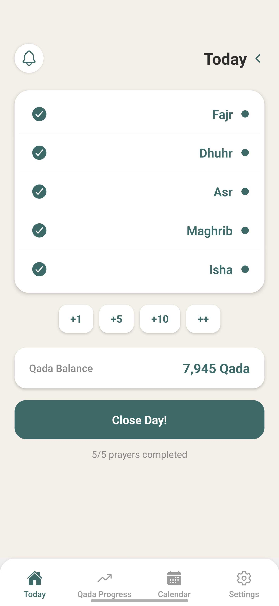
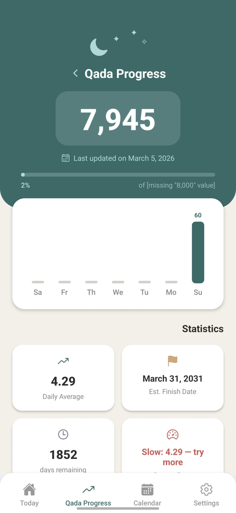
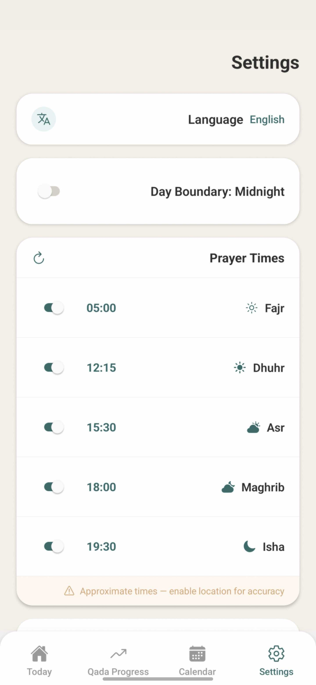

# 🕌 Qada Prayer Tracker

A mobile application designed to help Muslims **track daily prayers and
systematically complete missed prayers (Qada)** over time.

The app transforms what can feel like an overwhelming number of missed
prayers into **clear, trackable daily progress**.

------------------------------------------------------------------------

# 🌙 The Purpose

Many Muslims want to make up missed prayers but struggle with:

-   Not knowing how many prayers they owe
-   Feeling overwhelmed by the number
-   Losing motivation after a few weeks

**Qada Prayer Tracker** solves this by turning the journey into a
**simple daily habit** with visible progress.

Instead of thinking:

> "I have thousands of prayers to make up."

You begin thinking:

> "Today I completed a few more."

Over time, those small steps create real progress.

------------------------------------------------------------------------

# 📱 Core Features

## Daily Prayer Tracking

Track the five daily prayers:

-   Fajr
-   Dhuhr
-   Asr
-   Maghrib
-   Isha

Each prayer can be marked when completed during the day.

If a prayer is not completed before the day ends, it automatically
becomes part of your **Qada balance**.

------------------------------------------------------------------------

## Qada Prayer Balance

The app allows users to:

-   Estimate their total missed prayers
-   Maintain a running Qada balance
-   Reduce the balance as Qada prayers are completed

This helps transform a large number into something **manageable and
motivating**.

------------------------------------------------------------------------

## Quick Qada Logging

Users can easily log Qada prayers using simple quick actions such as:

-   +1 prayer
-   +5 prayers
-   +10 prayers

This makes recording progress extremely fast and frictionless.

------------------------------------------------------------------------

## Progress Tracking

The progress screen helps maintain motivation by showing:

-   Remaining Qada prayers
-   Daily completion average
-   Estimated completion timeline
-   Weekly activity overview

Seeing progress visually encourages long‑term consistency.

------------------------------------------------------------------------

## Prayer Reminders

The app can send **gentle reminders** for each prayer.

Users can:

-   Enable or disable reminders
-   Customize prayer reminder times
-   Adjust reminder offsets

These reminders help support consistency in daily worship.

------------------------------------------------------------------------

# 🧠 Philosophy

The app is based on a simple principle:

**Consistency beats intensity.**

Even a small number of Qada prayers completed daily can lead to
significant progress over months and years.

------------------------------------------------------------------------

## 📸 Screenshots

  
  
  

  <b>Today</b> &nbsp;&nbsp;&nbsp;&nbsp;&nbsp;&nbsp;&nbsp;&nbsp;&nbsp;&nbsp;&nbsp;&nbsp;&nbsp;&nbsp;
  <b>Progress</b> &nbsp;&nbsp;&nbsp;&nbsp;&nbsp;&nbsp;&nbsp;&nbsp;&nbsp;&nbsp;&nbsp;&nbsp;&nbsp;&nbsp;
  <b>Settings</b>

------------------------------------------------------------------------

# 📊 Example Progress

A user with **8,000 missed prayers** who completes:

-   5 Qada prayers per day

Will finish in approximately:

**\~4.3 years**

The app helps users visualize this progress clearly.

------------------------------------------------------------------------

# 🧭 App Sections

### Today

Track today's prayers and add Qada.

### Progress

View statistics and completion projections.

### History

Review past prayer activity.

### Settings

Customize reminders, language, and preferences.

------------------------------------------------------------------------

# 🤲 Who This App Is For

This app is designed for:

-   Muslims who want to **systematically complete missed prayers**
-   People seeking **structure and accountability**
-   Anyone building a **consistent prayer routine**

------------------------------------------------------------------------

# ❤️ Motivation

Making up missed prayers is a journey.

The purpose of this app is not pressure --- it is **support**.

Every completed prayer is progress.

------------------------------------------------------------------------

# ⚠️ Disclaimer

This application is a **personal tracking tool**.

It does **not provide religious rulings (fatwas)**. Users should consult
qualified scholars for guidance regarding religious obligations.

------------------------------------------------------------------------

# 🤝 Contributing

Contributions are welcome.

If you would like to help improve the project:

1.  Fork the repository
2.  Create a new branch
3.  Submit a pull request

Suggestions and feature ideas are always appreciated.

------------------------------------------------------------------------

# 📄 License

This project is licensed under the **MIT License**.

------------------------------------------------------------------------

# 🌙 Final Note

If this project helps even one person stay consistent with their
prayers, then it has served its purpose.

May Allah accept our prayers and efforts.
